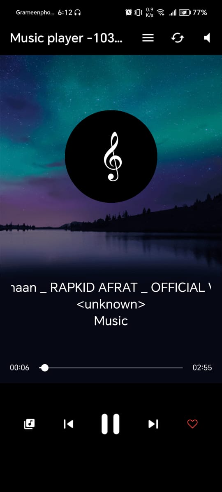
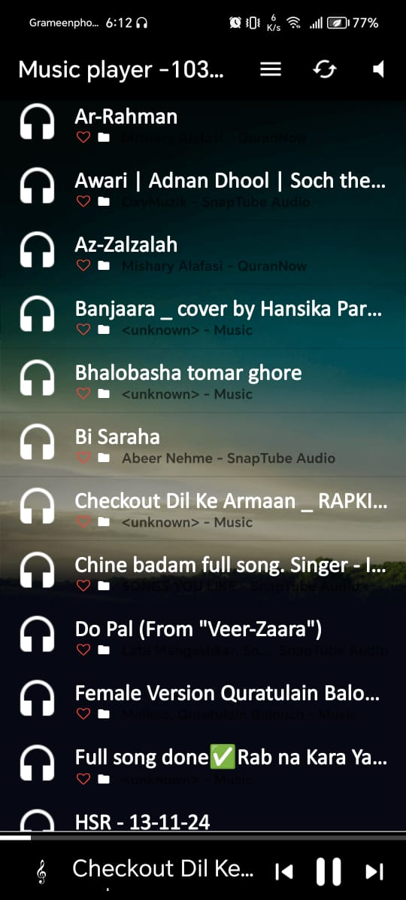
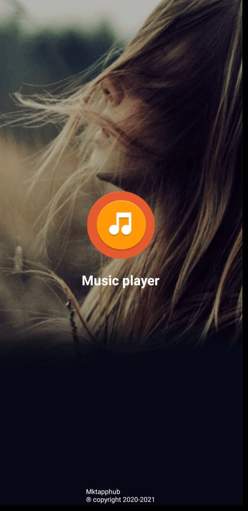

# 🎶 Music Player – MP3 & Audio Tag Editor  
A powerful offline music player with tag editor, ringtone cutter, equalizer, and all-format audio playback.

---

## 📖 Overview

**Music Player – MP3 & Audio Tag Editor** is a lightweight, feature-rich media player that supports **all major music formats** including MP3, FLAC, OGG, and more. Beyond just playback, it offers **tag editing**, **audio cutting**, **playlist management**, and **equalizer controls** for a personalized listening experience. Whether you're organizing your library or crafting a ringtone — this app does it all.

---

## ✨ Key Features

- 🎼 Auto-scan and display all music/audio files including hidden folders  
- 📁 Browse music by album, artist, genre, folder, and playlist  
- 🎵 Offline playback with lock screen and notification control  
- 🔊 Built-in **equalizer** with multiple sound profiles  
- ✂️ **Audio cutter** to remove parts of a track  
- 🎧 **Set music as ringtone** directly from the app  
- 📝 **Edit tags** (title, artist, album info)  
- 🎨 Customizable themes and skins  
- 🔍 Powerful search by title, album, or artist  
- 🧠 Smart playlist management (create, update, delete, recent)  
- 📲 Support for Bluetooth & wired headset controls  
- 🧩 **MVVM architecture** for structured and scalable codebase  
- 📡 Fully **offline app**, no internet needed  

---

## 🔧 Special Functionalities & Architecture

- 🧠 Designed using **MVVM architecture** for clean and maintainable code  
- 🎚️ **Custom audio editing tools**: tag editor, audio trimmer, and ringtone maker  
- 🔗 Integrated lock screen widget & notification controls  
- 🎧 Supports **headphone controls** and **Bluetooth devices**

---

## 🛠️ Tech Stack

- **Language:** Java  
- **IDE:** Android Studio  
- **Architecture:** MVVM  
- **Platform:** Android  

---

## 📸 Screenshots

| Player UI | Tag Editor | Audio Cutter |
|-----------|------------|----------------|
|  |  |  |

> *(Replace the image paths with your actual screenshots inside the `screenshots/` folder)*

---

## 🛡️ Important Notice

⚠️ **Security Notice:**  
Only screenshots and a portion of the source code are included in this repository for privacy and security reasons.

To access the full application or collaborate, please contact the developer:

📧 **mkt9319@gmail.com**

---

## 🙋 Contact

**Developer:** Minhajul Khan  
📧 Email: mkt9319@gmail.com

---

## 📄 License

This project is licensed under the [MIT License](LICENSE).  
Feel free to explore, fork, or contribute!
